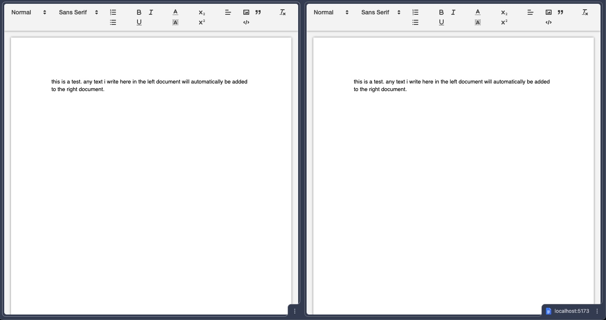

# Real-Time Collaborative Document Editor (Google Docs Lightweight Clone)

A full-stack, real-time collaborative text editor built with Node, React, MongoDB, and WebSockets (Socket.io). This application allows multiple users to edit the same document simultaneously, seeing changes in real-time, just like Google Docs.

## Key Features

- **Real-Time Collaboration:** Multiple users can edit the same document concurrently using WebSockets.
- **Rich Text Editing:** Integrated with Quill.js for a powerful, seamless formatting experience.
- **Auto-Saving:** Documents are automatically and periodically saved to the database.
- **Document Sharing:** Unique document URLs generated via UUID allow easy sharing among teams or users.
- **Persistent Storage:** All document data and changes are stored reliably in a MongoDB database with printing support.
- **Modern UI:** Clean, responsive, and familiar interface.

## Tech Stack

### Frontend

- **React 19** - UI Library
- **Vite** - Next Generation Frontend Tooling
- **Socket.io-client** - Real-time bidirectional event-based communication
- **Quill.js** - Rich text editor
- **React Router** - Client-side routing

### Backend

- **Node.js** - JavaScript runtime
- **Socket.io** - WebSockets layer for real-time collaboration
- **MongoDB & Mongoose** - NoSQL database and Object Data Modeling (ODM)

## 📂 Project Structure

```text
google_docs_clone/
├── client/              # React frontend (Vite)
│   ├── src/
│   │   ├── TextEditor.jsx # Quill editor & WebSocket logic
│   │   ├── App.jsx        # App routing
│   │   └── ...
│   └── package.json
└── server/              # Node.js backend
    ├── server.js        # Socket.io & DB connection setup
    ├── Document.js      # Mongoose Schema for documents
    └── package.json
```

## 🚀 Getting Started

Follow these instructions to set up the project locally on your machine.

### Prerequisites

- [Node.js](https://nodejs.org/) (v16+)
- [MongoDB](https://www.mongodb.com/) (Local or Atlas URI)

### Installation

1. **Clone the repository:**

   ```bash
   git clone https://github.com/your-username/google-docs-clone.git
   cd google-docs-clone
   ```

2. **Setup the Server:**

   ```bash
   cd server
   npm install
   ```

   > _Note: Make sure your MongoDB service is running locally, or configure your MongoDB URI within the server setup._

3. **Setup the Client:**
   ```bash
   cd ../client
   npm install
   ```

### Running the Application

1. **Start the Backend Server (Port 3001 typically):**

   ```bash
   cd server
   npm run devStart
   ```

2. **Start the Frontend Client (Vite):**

   ```bash
   cd client
   npm run dev
   ```

3. Open your browser and navigate to the frontend URL (usually `http://localhost:5173`). A new document with a unique ID will be created automatically. Open the same URL in a different tab or browser to see real-time collaboration in action!

## Demo Screenshot



## Future Enhancements

- User authentication (JWT or OAuth).
- Document dashboards for users to manage their saved documents.
- User presence indicators (displaying who is viewing/editing the document).
- Advanced document formatting and exporting to PDF.

## License

This project is licensed under the MIT License.
